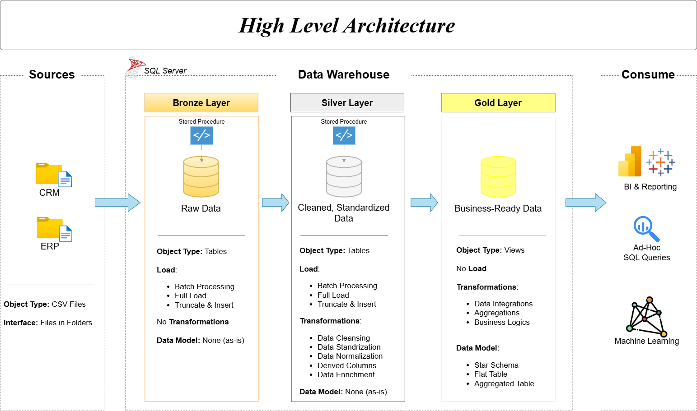
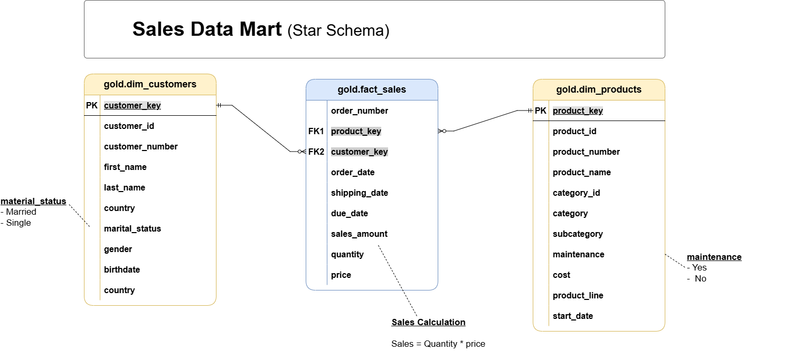

# SQL Data Warehouse Project

**Building a modern Data Warehouse with SQL Server** using the **Medallion Architecture** (Bronze → Silver → Gold).

This project demonstrates an end-to-end Data Warehouse solution with ETL processes, dimensional modeling, and analytics-ready data for reporting and business intelligence.



## 🎯 Project Overview

This repository contains a complete **SQL Server-based Data Warehouse** built from CRM and ERP source systems. It follows industry best practices for data warehousing, including:

- **Medallion Architecture** (Bronze, Silver, Gold layers)
- Automated ETL/ELT pipelines using stored procedures
- Star/Snowflake dimensional modeling
- Data quality and cleansing processes
- Business metrics and KPI calculations

## 🏗️ Architecture

### Data Flow
**Sources** → **Bronze (Raw)** → **Silver (Cleansed)** → **Gold (Business Layer)** → **Consumption**

| Layer     | Purpose                              | Data Quality     | Transformation Level |
|-----------|--------------------------------------|------------------|----------------------|
| **Bronze**    | Landing raw data                     | As-is            | Minimal              |
| **Silver**    | Cleansed & conformed data            | High             | Medium               |
| **Gold**      | Business-ready dimensional model     | Business-grade   | High                 |


## 🚀 Features

- **Full ETL Pipeline**: Stored procedures for loading each layer
- **Incremental Loading** support
- **Data Quality Checks**
- **Dimensional Modeling** (Facts & Dimensions)
- **SCD (Slowly Changing Dimensions)** handling
- **Business Metrics Layer** in Gold
- **Reusable & Modular** SQL scripts

## 🛠️ Technologies

- **SQL Server** (TSQL)
- **SSMS** (SQL Server Management Studio)
- Medallion Architecture
- Star Schema Dimensional Modeling

## 📋 Getting Started

### Prerequisites
- SQL Server 2019 or later
- SQL Server Management Studio (SSMS)

### Installation & Setup

1. **Clone the repository**
   ```bash
   git clone https://github.com/Narges2017/Sql-Data-Warehouse-Project.git
   📊 Data Model
(Add your data model diagram here)

## 📚 Documentation

Data Architecture
Data Flow
Naming Conventions
Data Catalog

## 🤝 Contributing
- Contributions are welcome! Feel free to:

- Improve ETL performance
- Add more business metrics
- Enhance documentation
- Add Power BI / reporting examples

 ## 📄 License
- This project is licensed under the MIT License - see the LICENSE file for details.
